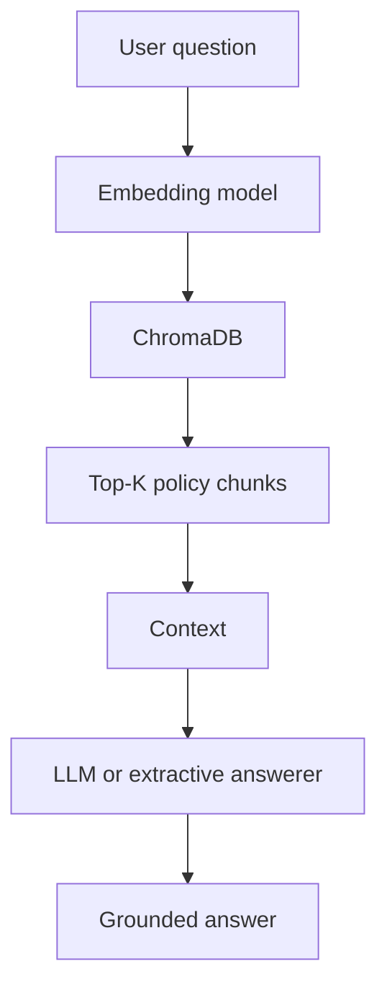

# Day 10 Vector DB RAG

## 1. Project Name
Day 10 Vector Database and RAG Learning Project.

## 2. Project Objective
Learn the complete path from company documents to embeddings, semantic retrieval, context, and a grounded answer.

## 3. What are embeddings?
Embeddings are lists of numbers that represent patterns and meaning in text. Related text tends to have nearby vectors.

## 4. What is a vector database?
A vector database stores embeddings with their documents and metadata, then finds nearby vectors quickly.

## 5. Why ChromaDB?
ChromaDB is local, simple to inspect, and useful for learning the collection, document, embedding, and metadata workflow.

## 6. What is semantic search?
Semantic search finds content with a similar meaning even when it does not use the same words.

## 7. What is RAG?
Retrieval-Augmented Generation retrieves relevant context before an LLM generates an answer. This project includes an extractive no-key fallback.

## 8. System Architecture



## 9. Installation Steps

From the repository root:

```bash
python -m venv .venv
.venv\\Scripts\\activate
python -m pip install -r requirements.txt
```

The first embedding run downloads `all-MiniLM-L6-v2`. It returns 384-dimensional vectors.

## 10. How to Run

```bash
python document_store.py
python semantic_search.py
python rag_pipeline.py
python retrieval_evaluation.py
python -m unittest discover -s tests
```

## 11. Example Questions

- How do I apply for leave?
- When will I receive my salary?
- What happens if I come late?
- Who approves leave?
- What is the attendance policy?
- How do I request vacation?

## 12. Example Answers

For `How do I apply for leave?`, retrieval should find `leave_policy.txt`, which says to use the HR portal and submit before the planned leave date. For `Who approves leave?`, it should retrieve the manager approval rule.

## 13. Retrieval Evaluation Results

Run `python retrieval_evaluation.py` after indexing. The script reports the measured count and accuracy for ten questions. Results are intentionally generated by the trainee rather than invented in advance.

## 14. Limitations

The demo uses one general-purpose embedding model, simple word chunking, no reranker, and an extractive answerer. Retrieval quality depends on the model and the policy writing. It is not an authorization system or a source of legal advice.

## 15. Future Improvements

Add hybrid keyword plus vector search, metadata filters, better sentence-aware chunking, reranking, citations, an LLM with a strict context prompt, answer evaluation, access control, and a production database.
